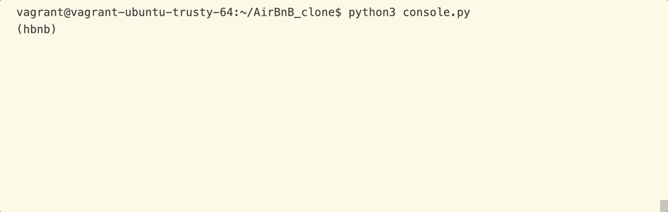

# AIRBNB CLONE - THE CONSOLE
This repository implements the Control Console for the AirBnb clone project and the
first stage for a DB implementation related to the class instances' serialization and deserialization process.

It has a Unittest suite test for a 100% quality software.

## Use examples
1. Run and get help on how to use it, create a new instance and check for all instances already created:

2. Use a method for each class and exit the Console:

3. Use destroy command with class name and unique Id:

## Motivation
This project is made for learning purposes and because ***#PythonIsCool***.

It is part of the **Unit 01 — Higher-level Languages** at [Holberton School](https://www.holbertonschool.com/pathway_foundations).

## Prerequisites
As this shell is built upon Ubuntu trusty 14.04 LTS, please use a compatible operating system.

### Installation

Clone the repository at: [AirBnb Clone](https://github.com/kajoomba99/AirBnB_clone)

### And coding style tests
[PEP8 coding style](https://www.python.org/dev/peps/pep-0008/)

## Built With
Python 3.4.
Visual Basic Code
Linux 14.04 LTS

## Contributing
Not open to contibuiting. Thanks for your interest :)

## Authors

Steven Brand - Sofware Developer - [@kajoomba99](https://www.linkedin.com/in/steven-brand-ramirez-092952139/)
> :rocket: Let's follow each other on [Github](https://github.com/kajoomba99)

Ricardo Hincapie - Software Developer - [@RicarHincapie](https://www.linkedin.com/in/ricardohincapie/)
> :rocket: Let's follow each other on [Github](https://github.com/ricarhincapie)

## License
This project is not licensed.

## Acknowledgments
To our family, for whom all the effort is worth it.

To the coding global community, for its efforts to keep knowledge available.
